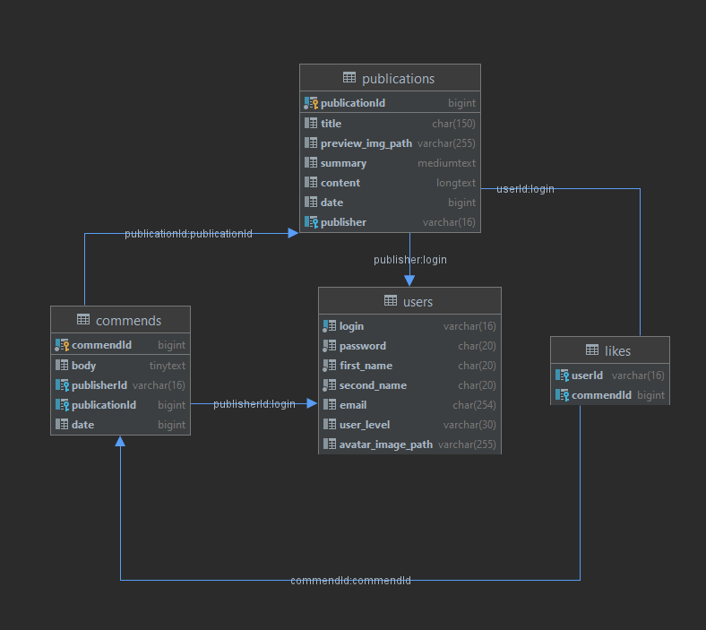

# 4DPA
4DPA - news site.

## Table of contents
1. [General info](#General-info)
2. [Roles](#Roles)
3. [Features](#Features)
4. [Database structure](#Database-structure)
5. [Technologies](#Technologies)
___
## General info
4DPA is news site.

#### Roles
- Guest
    - Can view main page
    - Can change localization
    - Can watch publications
    - Can watch profiles
    - Can search for publications
    - Can sign in and sign up
- User
    - Can do all the stuff, that guest can
    - Can upload profile image
    - Can post commends
    - Can like/unlike commends
    - Can log out
- Publisher
    - Can do all the stuff, that user can
    - Can create publications
    - Can edit publications
    - Can delete publications
- Admin
    - Can do all the stuff, that publisher can
    - Can watch admin panel
    - Can delete users
    - Can delete commends
___
## Features
### Full service localization
All text content that is on pages can be translated by one click
from **English** to **Russian** and vice versa.

### Main page pagination
Posts are shown on different pages using server-side pagination

### Async like/unlike system
Users can like/unlike commends without updating page

### File uploading
Users can upload own image files and use in publications or as profile image.

___
## Database structure

___
## Technologies
- [JDK 8](https://www.oracle.com/java/technologies/javase/javase-jdk8-downloads.html) - Java Development kit 8
- [Maven](https://maven.apache.org/) - Project build tool
- [Tomcat](http://tomcat.apache.org/) - Servlet container
- [Java EE](https://www.oracle.com/java/technologies/java-ee-glance.html) - Java Servlet, JSP(Java server pages)
- [MySQL](https://www.mysql.com/) - Open source SQL database
- [JDBC](https://docs.oracle.com/javase/8/docs/technotes/guides/jdbc/) - Java Database Connectivity API
- [JSTL](https://docs.oracle.com/javaee/5/tutorial/doc/bnake.html) - Library for JSP
- [Log4j](https://logging.apache.org/log4j/2.x/) - Logging library
- [TestNG](https://testng.org/doc/) - Testing framework
